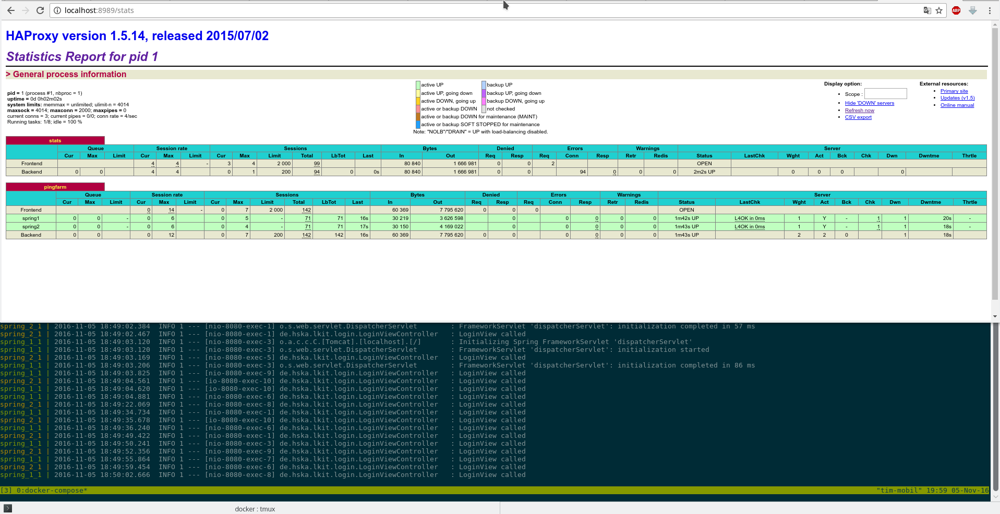

# Verteilte Systeme 2 Labor
[](https://travis-ci.com/daB0bby/destributed-systems-2-lab)

## Kurzbeschreibung
Twitter-Clone mit Spring-Boot, Spring Web, Redis und Thymeleaf

## Setup
  - Spring Tool Suite downloaden
  - Projekt Importieren: File -> Import... -> Maven -> Existing Maven Projects
  - Starten über Panel links unten: Boot Dashboard
  - Im Browser aufrufen unten http://localhost:8080/
  
## Docker-Compose

```bash
cd src/main/docker/
docker-compose up
```



  
  
